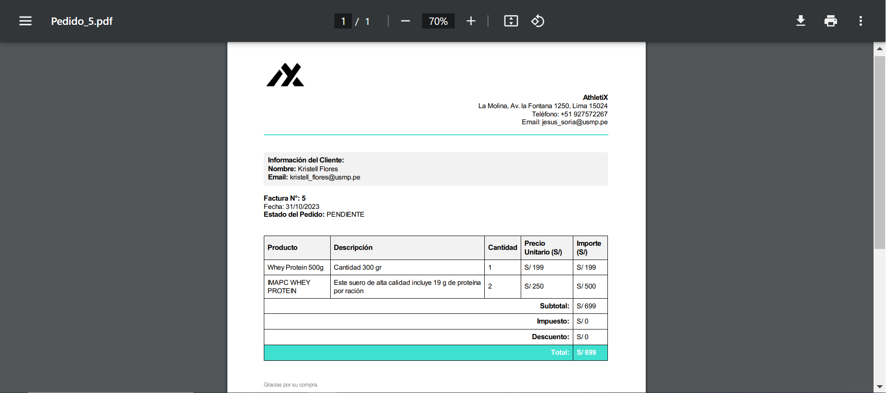
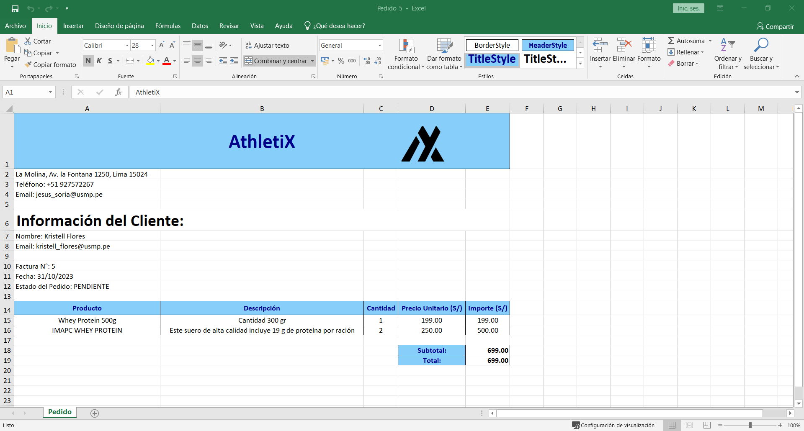

  

# Ecommerce Tienda Deportiva

Prueba de docker con web service, realizare un merge de mi rama

Subiendo estilos para navbar y footer

Probando probando xd

Agregando 3 atributos al register, falta agregar algunas cosas

Agregando el logo de la empresa, el pdf de termino y condiciones, pdf para politica de privacidad,
añadiendole un atributo a la tabla netusers llamado rol

Le añadi en la rama de jesus_avance3 la misión, visión y descripción de la empresa

Añadi para exportar en pdf y excel toda la lista y uno solo, tambien le añadi el buscador de productos ya esta funcionando, tambien le añadi el eliminar producto, y valide que cuando se registre o edite un producto te salga un mensaje de que el registro o la actualizacion fue exitosa, eso lo hice en la rama jesus_avance5

En la rama jesus_avance6 comence a ponerle el carrito de compras

Puse cambios el 03/10/2023 en la rama de jesus_avance7

En jesus_avance8 agregue cambios nuevos el 04/10/2023 17:30 como el logo en el pdf

En jesus_avacen9 arregle la vista detalleproducto.cshtml el dia 05/10/2023

En la rama Agregando Funcionalidades añadi dos comits: añadiendo el método de pago, el pedido y el detalle del pedido. Y dejando todo listo la parte del carrito, pago, pedido y detalle pedido tanto para el cliente como el administrador. 8/10/23
-Kristell Flores

En jesus_avacen10 valide lo del stock, tambien para restablecer la contraseña y confirmar el email, tambien puse este comando para generar toda la carpeta de identity

dotnet aspnet-codegenerator identity -dc proyecto_ecommerce_deportivo_net.Data.ApplicationDbContext --force

En jesus_avance11 agregue estas dependencias para poder autenticarme con google
dotnet add package Microsoft.AspNetCore.Authentication.Google
dotnet add package Microsoft.AspNetCore.CookiePolicy

En jesus_avance11 configue para autenticarme con google y en este commit también solo modifique la lista de cliente en vez de buscar producto es buscar usuario

En jesus_avance12 vincule ya la tabla AspNetUsers, AspNetRoles y AspNetUserRoles en mi dbeaver y en el codigo del backend ya programe que vera un admin y que vera un no admin y un no logueado

En 8-pasarela-de-pagos arregle el metodo create del controller de pago

Tambien en 8-pasarela-de-pagos le puse en la vista detalle producto el stock y valide lo que tenia que validar

probando probando xdxd

En la rama 4-carrito-de-compras arregle el logo de los metodos de exportacion de pdf para productos, usuarios, y pedidos.

Tambien añadi una vista que luego la programare para que se muestren graficos estadisticos de lineas de tiempo mostrando las ventas del mes o semanales xdxd

## IMAGEN DE LA FACTURA O PEDIDO Nro 5 de AthletiX
EN PDF

EN EXCEL

Dandole creditos a kristell xd

Dandole creditos a kristell x2 xd

En el Shared --> _Layout.cshhtml ya esta asignada la logica para delegar que vera un administrador y un cliente de acuerdo a su rol que se le asigno en la base de datos de la tabla de roles y de usuarios en nuestro dbeaver xd

El login para usuarios ya esta terminado, se pueden registrar clientes llenando un formulario o con su cuenta de google si asi lo quiere el cliente xd

### COMANDOS PARA HACER UNA MIGRACION

git checkout -b pruebasoftware

dotnet ef migrations add PruebasSMigration

dotnet ef database update

dotnet watch run

### CREDENCIALES DE LA BASE DE DATOS DE RENDER

Host: dpg-cvno5s24d50c73d0u01g-a.oregon-postgres.render.com 

Username: pruebas_software_user 

Database: db_pruebas_software

Password: kiR3UaUOn1U2FBJycgJHXDtd5vKH8y3i

ESTA BASE DE DATOS SE CREO EL DIA 04 DE ABRIL, ANTES DEL 4 DE MAYO HACER UN BACKUP Y MIGRAR A OTRA DB GRATUITA

## LINK DE LA PAGINA

https://athletix.onrender.com/

  

